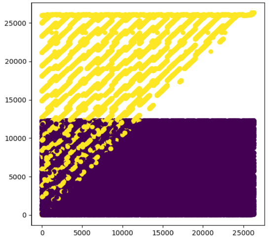

# How to win a data science competition

My notes from the Coursera course, hosted [here](https://www.coursera.org/learn/competitive-data-science).  

I'm only including my notebooks here for my reference. Supporting data files are available on the course.  

Patricia Schuster  
Dec. '19-Jan '20  

# Week 1: Pandas Basics

[Course notes here](week_1_notes.ipynb)  

* Course overview  
* Recap of main ML algorithms  
* Feature processing and generation  
* Categorical and ordinal features  
* Datetime and coordinates  
* Handling missing values  
* Feature extraction from text and images  

[Assignment here](week_1_assignment_pandas_basics/PandasBasics.ipynb)  

* Examine dataframe shape, features of the final project dataset   
* Generate new columns: `datetime`, revenue, category  
* Calculate a few things:  
    * Maximum total revenue among shops  
    * Identify highest revenue category  
    * Evaluate price fluctuations  
    * Calculate variance    

# Week 2

[Course notes here](week_2_notes.ipynb)  

* Exploratory data analysis  
* Dataset cleaning, data leakages  
* Validation and overfitting  
* Data leakages  

[Assignment here](week_2_assignment_data_leakages/Data%2Bleakages.ipynb)  

* Exploit a severe data leakage in a real competition  
* Analyze the `(FirstId,SecondId)` coordinates, which are related to the target  
* Use a leaderboard probing technique to determine frequency of target values  
* Write a method for extracting coordinates along the diagonal lines  
* Perfect the method with a few tedious techniques  
* It turns out this is not the method that the instructors expected us to do, so I must have used the alternate method.  

# Week 3
 
[Course notes here](week_3_notes.ipynb)  

* Metrics optimization  
    * Regression metrics: MSE, RMSE, MAE  
    * Classification metrics: accuracy, logloss, AUC, Cohen's Kappa  
* Target encoding / likelihood encoding  
    * Mean encoding  
    * Frequency encoding  
    * Likelihood, weights, counts, diff  
* Regularization  
    * Cross-validation loop inside training data  
    * Smoothing  
    * Adding random noise  
    * Sorting and calculating expanding mean  

[Assignment here](week_3_assignment_mean_encodings/Programming_assignment_week_3.ipynb)

* Encode `item_id` in four different ways:  
    * `KFold` scheme  
    * Leave-one-out scheme  
    * Smoothing scheme  
    * Expanding mean scheme  
* Calculate the correlation coefficient for each result to the `target`, submit to grader  